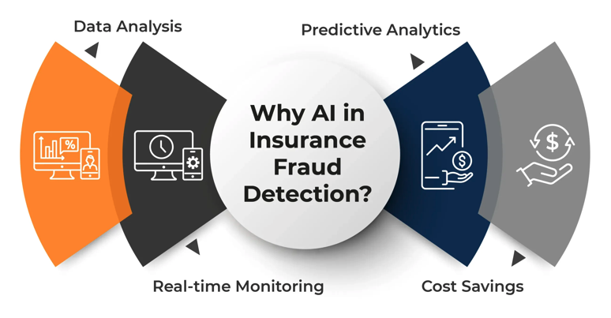

# Insurance Fraud Detection & Analysis


Projet complet de Machine Learning applique a la **detection de fraude** dans les reclamations d'assurance automobile. Il couvre l'ensemble du cycle de vie d'un projet Data Science : exploration des donnees, modelisation supervisee, segmentation non supervisee et deploiement d'une application web de prediction.

<p align="center">
  
</p>

---

## Contexte metier

La fraude a l'assurance represente un cout majeur pour le secteur : entre **5% et 10% des reclamations** sont estimees frauduleuses, generant des milliards de dollars de pertes chaque annee. Ce projet propose deux approches complementaires pour aider les assureurs a identifier les reclamations suspectes :

- **Approche supervisee** : un modele de classification entraine sur des cas historiques de fraude, deploye via une API et une interface web
- **Approche non supervisee** : une segmentation du portefeuille de reclamations pour identifier les profils a risque, sans a priori sur les etiquettes de fraude

---

## Vue d'ensemble

| Projet | Type | Objectif | Algorithmes | Deploiement |
|--------|------|----------|-------------|-------------|
| [Insurance Fraud Classification](#1--insurance-fraud-classification) | Supervise — Classification | Predire si une reclamation est frauduleuse | KNN, Logistic Regression, Decision Tree, Random Forest, **XGBoost**, SMOTE | FastAPI + Streamlit |
| [Insurance Fraud Clustering](#2--insurance-fraud-clustering) | Non supervise — Clustering | Segmenter les reclamations en profils de risque | **KMeans**, Hierarchique, GMM, DBSCAN, PCA, t-SNE, UMAP | Notebook |

---

## Structure du depot

```
Clevory Assurance/
│
├── README.md                                    # Ce fichier
├── ai_insurance_fraud.png                       # Image du projet
│
├── Insurance Fraud Classification/              # Projet supervise
│   ├── README.md                                # Documentation detaillee
│   ├── requirements.txt                         # Dependances Python
│   ├── insurance_claims.csv                     # Dataset (1 000 reclamations)
│   ├── insurance_fraud_analysis.ipynb           # Notebook EDA + modelisation
│   ├── backend/
│   │   ├── prepare_model.py                     # Entrainement et export des artefacts
│   │   ├── app.py                               # API REST FastAPI (3 endpoints)
│   │   ├── model.pkl                            # Modele XGBoost entraine
│   │   ├── scaler.pkl                           # StandardScaler
│   │   ├── label_encoder_sex.pkl                # LabelEncoder (insured_sex)
│   │   ├── feature_names.pkl                    # Ordre des features
│   │   ├── cat_mappings.pkl                     # Mappings one-hot encoding
│   │   └── test_prod.csv                        # Fichier de test (5 reclamations)
│   └── frontend/
│       └── frontend.py                          # Interface Streamlit (3 pages)
│
├── Insurance Fraud Clustering/                  # Projet non supervise
│   ├── README.md                                # Documentation detaillee
│   ├── insurance_claims.csv                     # Dataset (meme source)
│   └── clustering_analysis.ipynb                # Notebook clustering complet
│
└── Supports/                                    # Supports pedagogiques
    ├── introduction.pdf                         # Fondamentaux du ML
    ├── supervised.pdf                            # Apprentissage supervise
    └── unsupervised.pdf                          # Apprentissage non supervise
```

---

## Dataset

**Source :** `insurance_claims.csv` — 1 000 reclamations d'assurance automobile avec 39 variables.

Le dataset couvre quatre categories d'information :

| Categorie | Variables cles | Exemples |
|-----------|---------------|----------|
| **Assure** | Age, sexe, profession, hobbies, anciennete | Un assure de 48 ans, medecin, pratiquant le parachutisme |
| **Police** | Etat, franchise, prime annuelle, limites CSL, umbrella | Police souscrite en Ohio, franchise 1 000$, prime 1 400$/an |
| **Incident** | Type, severite, heure, temoins, rapport de police | Collision frontale, degats majeurs, 0 temoin, pas de rapport de police |
| **Reclamation** | Montant total, blessures, propriete, vehicule | Reclamation de 71 610$ (blessures: 6 510$, propriete: 13 020$, vehicule: 52 080$) |

**Variable cible :** `fraud_reported` (Y/N)

> Pour la description detaillee de chaque variable avec des explications accessibles aux non-specialistes, consulter le [README du projet Classification](./Insurance%20Fraud%20Classification/README.md#variables-principales-).

---

## Projets

### 1 · Insurance Fraud Classification

> Predire si une reclamation d'assurance est frauduleuse a partir de ses caracteristiques, puis deployer le modele sous forme d'application web.

#### Notebook d'analyse

Le notebook `insurance_fraud_analysis.ipynb` couvre 8 etapes :

1. **EDA approfondie** — Distributions, crosstabs, analyse bivariee, violin plots, pairplots
2. **Skewness & Kurtosis** — Calcul, interpretation automatique, test de normalite de Shapiro-Wilk, visualisation avec courbe normale theorique
3. **Detection des outliers** — Box plots par groupe, quantification par methode IQR
4. **Preprocessing** — Remplacement des `?` par le mode, encodage (LabelEncoder + One-Hot), StandardScaler, split stratifie 80/20
5. **Modelisation baseline** — 5 modeles compares (KNN, Logistic Regression, Decision Tree, Random Forest, XGBoost)
6. **Fine-tuning** — GridSearchCV avec StratifiedKFold (5 folds, scoring F1) sur les 3 meilleurs modeles
7. **Gestion du desequilibre** — Application de SMOTE pour equilibrer les classes
8. **Selection de features** — SelectKBest avec K = 10, 15, 20

#### API Backend (FastAPI)

| Methode | Endpoint | Description |
|---------|----------|-------------|
| `GET` | `/` | Health check |
| `POST` | `/predict` | Prediction pour une reclamation individuelle |
| `POST` | `/predictCSV` | Prediction par lot — upload d'un CSV, retourne un CSV avec les predictions |

Exemple de requete :

```bash
curl -X POST http://localhost:8000/predict \
  -H "Content-Type: application/json" \
  -d '{"age": 48, "incident_type": "Single Vehicle Collision", "incident_severity": "Total Loss", "total_claim_amount": 95000}'
```

Exemple de reponse :

```json
{
  "prediction": 1,
  "fraud_probability": 0.7823,
  "label": "Fraud",
  "risk_level": "High",
  "input_summary": { ... }
}
```

#### Frontend (Streamlit)

L'interface web comporte 3 pages :

| Page | Fonctionnalite |
|------|----------------|
| **Prediction** | Formulaire interactif (~30 champs) avec jauge de risque Plotly |
| **Prediction CSV** | Upload CSV, predictions par lot, histogramme des probabilites, export des resultats |
| **Dashboard** | 14 graphiques interactifs : KPIs, taux de fraude par categorie, distributions, matrice de correlation, scatter plots |

#### Lancement

```bash
cd "Insurance Fraud Classification"
pip install -r requirements.txt

# Regenerer le modele (optionnel)
cd backend && python prepare_model.py

# Terminal 1 — Backend
cd backend && uvicorn app:app --host 127.0.0.1 --port 8000

# Terminal 2 — Frontend
cd frontend && streamlit run frontend.py
```

| Service | URL |
|---------|-----|
| API | http://localhost:8000 |
| Swagger UI | http://localhost:8000/docs |
| Frontend | http://localhost:8501 |

---

### 2 · Insurance Fraud Clustering

> Segmenter les reclamations d'assurance en groupes homogenes par clustering, puis verifier si certains segments concentrent un taux de fraude anormalement eleve.

#### Pourquoi le clustering en complement de la classification ?

Un modele supervise detecte la fraude a partir de **patterns connus**. Le clustering permet de :

- **Decouvrir des patterns inconnus** : regrouper des reclamations similaires sans a priori
- **Cibler les investigations** : un cluster avec 40% de fraude vs 25% en moyenne = priorite d'audit
- **Detecter les anomalies** : les points de bruit (DBSCAN) sont des reclamations atypiques a verifier

#### Contenu du notebook

| Etape | Methode | Metriques / Outils |
|-------|---------|-------------------|
| Reduction de dimensionnalite | PCA, t-SNE, UMAP | Scree plot, variance expliquee |
| Selection du K optimal | Elbow + KneeLocator | Silhouette, Davies-Bouldin, Calinski-Harabasz |
| KMeans | Centroides, profiling | Heatmap, radar chart, silhouette plot |
| Interpretation | Decision Tree sur clusters | Tree plot, feature importance |
| Hierarchique | Ward linkage | Dendrogramme, AgglomerativeClustering |
| GMM | Gaussian Mixture | BIC, AIC |
| DBSCAN | KNN + KneeLocator pour epsilon | Detection du bruit / outliers |
| Comparaison | Toutes methodes | ARI, NMI, taux de fraude par cluster |

#### Lancement

```bash
cd "Insurance Fraud Clustering"
pip install pandas numpy matplotlib seaborn scikit-learn scipy kneed umap-learn
jupyter notebook clustering_analysis.ipynb
```

---

## Concepts couverts

### Apprentissage supervise — Classification

- Encodage des variables categorielles (LabelEncoder, One-Hot Encoding)
- Gestion du desequilibre de classes (SMOTE)
- Analyse du Skewness et Kurtosis, test de normalite (Shapiro-Wilk)
- Hyperparameter tuning avec GridSearchCV et StratifiedKFold
- Selection de features (SelectKBest, f_classif)
- Metriques : Accuracy, Precision, Recall, F1-Score, ROC-AUC
- Courbes ROC et Precision-Recall

### Apprentissage non supervise — Clustering

- Reduction de dimensionnalite : PCA, t-SNE, UMAP
- Selection du nombre de clusters : Elbow, KneeLocator, Silhouette, Davies-Bouldin, Calinski-Harabasz, BIC/AIC
- KMeans, Clustering Hierarchique (Ward), GMM, DBSCAN
- Profiling des clusters via centroides et arbres de decision
- Evaluation externe : ARI, NMI

### Deploiement ML

- Serialisation d'un pipeline complet (pickle)
- API REST avec FastAPI et validation Pydantic
- Prediction unitaire et par lot (upload CSV)
- Interface utilisateur interactive avec Streamlit et Plotly

---

## Stack technique

| Categorie | Technologies |
|-----------|-------------|
| Manipulation de donnees | `pandas`, `numpy` |
| Visualisation | `matplotlib`, `seaborn`, `plotly` |
| Machine Learning | `scikit-learn`, `xgboost` |
| Desequilibre de classes | `imbalanced-learn` (SMOTE) |
| Reduction de dimensionnalite | `umap-learn`, `scikit-learn` (PCA, t-SNE) |
| Statistiques | `scipy` |
| Selection de K | `kneed` (KneeLocator) |
| Backend | `fastapi`, `uvicorn`, `pydantic`, `python-multipart` |
| Frontend | `streamlit`, `plotly`, `requests` |

---

## Auteur

**Bassem Ben Hamed**

Projet realise dans le cadre d'une formation Machine Learning — **fraud-detection-insurance-claims**.
